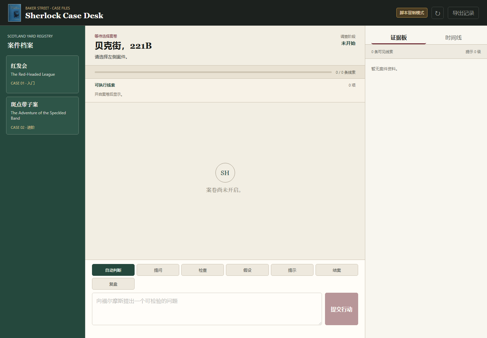

# Anima Sherlock Agent

[](https://github.com/Firefly0237/anima-sherlock-agent/actions/workflows/ci.yml)
[](https://www.python.org/downloads/)
[](LICENSE)
[](https://huggingface.co/Bot42/anima-sherlock-qwen36-27b-dpo-lora)

Anima is a source-grounded Chinese Sherlock Holmes dialogue agent combining a
QLoRA-post-trained Qwen model, typed tools, deterministic mystery state, and
scoped memory. The application remains authoritative for evidence and writes.



## What this project demonstrates

- A complete SFT-to-DPO post-training path for character dialogue.
- Source-grounded persona and mystery packs with explicit provenance.
- Schema-validated tool proposals instead of unrestricted model-side actions.
- Two playable cases with deterministic evidence, reveals, and progression.
- PostgreSQL and pgvector memory with user/persona isolation and atomic writes.
- A no-GPU scripted demo plus a model-backed Agent API.

## Architecture

| Component | Responsibility |
| --- | --- |
| Dialogue adapter | Character voice, grounded answers, refusal behavior, and action proposals |
| Model runtime | Chat template, generation, streaming, and model identity checks |
| Tool layer | Parse, validate, authorize, and execute structured proposals |
| Case engine | Hidden truth, visible evidence, progression, hints, and scoring |
| Memory layer | Scoped retrieval, validated CRUD operations, and durable commits |

Tool and memory proposals pass through schema and policy checks before the
deterministic engine applies a transition and returns its result.

```text
Browser / client
       |
       v
Agent API ---- context builder ---- persona, lore, conversation, memory
       |
       v
Model endpoint ---- response text + typed tool proposal
       |                           |
       |                           v
       |                    schema / policy checks
       |                           |
       +---------------------------v
                         deterministic case engine
                                    |
                                    v
                         PostgreSQL + pgvector
```

## Quick start: scripted demo

The scripted browser demo exercises the case engine without a GPU or database.

```bash
git clone https://github.com/Firefly0237/anima-sherlock-agent.git
cd anima-sherlock-agent
python -m venv .venv
source .venv/bin/activate
python -m pip install -e .
python -m anima.case_game.runtime.demo_server \
  assets/cases/sherlock/levels 127.0.0.1 8765
```

On Windows PowerShell, activate with `.\.venv\Scripts\Activate.ps1`. Open
<http://127.0.0.1:8765>, choose a case, and begin the investigation.

## Model-backed runtime

The full path uses an OpenAI-compatible model endpoint and the Agent API.
Persistent memory requires PostgreSQL with pgvector. A local 27B endpoint needs
a CUDA environment with sufficient accelerator memory.

```bash
python -m pip install -e ".[serve,model-serve]"
docker compose up -d db
cp configs/runtime.example.yaml configs/runtime.local.yaml
```

Edit `configs/runtime.local.yaml` with the published adapter ID and SHA-256.
Then start the model endpoint with a local adapter directory:

```bash
python -m anima.serve.inference.transformers_server \
  --runtime-config configs/runtime.local.yaml \
  --adapter-dir /path/to/adapter \
  --load-in-4bit \
  --host 127.0.0.1 \
  --port 8000
```

In a second terminal, start the Agent API:

```bash
export ANIMA_CONFIG=configs/runtime.local.yaml
export ANIMA_PACKS_ROOT=persona_packs/public
python -m anima.serve.api.app
```

The API listens on port `8080` by default. Windows users can set the same
variables with `$env:ANIMA_CONFIG=...` and `$env:ANIMA_PACKS_ROOT=...`.

## Agent and memory design

Agent behavior is expressed as typed case and memory proposals. The runtime
rejects malformed or unauthorized calls and passes accepted operations to
deterministic services. Text is probabilistic; game truth remains controlled.

Memory retrieval is scoped by user and persona. Writes are validated and
committed atomically, supporting continuity while preserving memory isolation.

## Post-training recipe

The released adapter follows a conventional two-stage alignment path. SFT
teaches response format, role behavior, grounded QA, memory intents, and safety
boundaries. DPO then trains on paired responses using the frozen SFT policy as
the reference, avoiding a separately trained reward model.

| Stage | Records | Objective | Length | Epochs | Learning rate |
| --- | ---: | --- | ---: | ---: | ---: |
| SFT | 260 | Completion-only cross-entropy | 4,096 | 2 | `5e-5` |
| DPO | 70 pairs | Sigmoid DPO, `beta=0.1` | 3,072 | 1 | `5e-6` |

Both stages use the pinned `Qwen/Qwen3.6-27B` revision, 4-bit NF4 with double
quantization and bfloat16 compute, rank-16 LoRA with alpha 32, an effective
batch size of four, cosine scheduling, and seed 42. QLoRA keeps the frozen base
model quantized while training adapter parameters, making the 27B workflow
practical on a single high-memory GPU. Configuration is preserved in
[`configs/sft.yaml`](configs/sft.yaml) and [`configs/dpo.yaml`](configs/dpo.yaml).

Replace the placeholder data, adapter, and output paths first. The entry points
then support a dependency-light dry run before the GPU stack is imported:

```bash
python -m pip install -e ".[train]"
python -m anima.train.algorithms.sft --config configs/sft.yaml --dry-run
python -m anima.train.algorithms.dpo --config configs/dpo.yaml --dry-run
```

## Data and evaluation

The data pipeline accepts conversational SFT rows and strict `chosen`/`rejected`
pairs derived from identified public-domain Sherlock Holmes sources, task
templates, and curated examples. Checks cover schema, provenance, duplicates,
split isolation, prompt/label leakage, length, and rubric-based review.

Evaluation is separated into three layers:

1. Artifact integrity: configuration parsing, tensor finiteness, hashes, and
   adapter reload behavior.
2. Contract tests: tools, memory isolation, output parsing, case rules, and
   model-client interfaces.
3. Application smoke tests: final-adapter inference and end-to-end case flows.

The pre-release snapshot passed 274 published-code tests and 53 tests against a
clean Git export. The final adapter contains 800 tensors and 108,789,760 adapter
parameters; all tensors passed finiteness checks and live inference reload.
Together, these checks verify release integrity and runtime compatibility.

## Repository layout

```text
assets/                 Deterministic Sherlock mystery packs
configs/                Portable SFT, DPO, and runtime recipes
docs/assets/            Public demo media
persona_packs/public/   Persona, lore, safety, and source records
src/anima/              Training, serving, tools, memory, and case engine
tests/                  Unit and contract tests for published code
```

## Development

```bash
python -m pip install -e ".[dev]"
python -m ruff check src tests
python -m ruff format --check src tests
python -m pytest tests -q
```

## Current scope

- The adapter is optimized for Sherlock Holmes and primarily Chinese dialogue.
- Grounding quality depends on the supplied persona, lore, and retrieval context.
- Spoiler control, memory isolation, and tool execution are provided by the
  integrated Agent runtime.

## Acknowledgements

Built with [Qwen](https://huggingface.co/Qwen),
[Transformers](https://github.com/huggingface/transformers),
[PEFT](https://github.com/huggingface/peft), and
[TRL](https://github.com/huggingface/trl). The role-playing design is informed
by [RoleLLM](https://github.com/InteractiveNLP-Team/RoleLLM-public). Source and
license notes for Sherlock Holmes material are stored beside the public persona
and case packs.

## License and contact

Code is licensed under [Apache-2.0](LICENSE) unless a path states otherwise.
Persona and case assets retain the licenses declared in their directories.
For defects or usage questions, open a GitHub issue. Maintained by
[@Firefly0237](https://github.com/Firefly0237).
